<div align="center">

# ContextPilot
### Your Workflow Is the Prompt.

> **A context-intelligence layer that transforms digital activity into structured context, inferred intent, and actionable AI assistance.**

```
Context → Intent → Action
```

[](https://github.com/NebulaVoltage/context-pilot)
[](https://react.dev/)
[](https://www.typescriptlang.org/)
[](https://threejs.org/)
[](https://vitejs.dev/)
[](https://tailwindcss.com/)

[Live Application](https://context-pilot-seven.vercel.app) • [GitHub Repository](https://github.com/NebulaVoltage/context-pilot) • [System Architecture](/system) • [Interactive Demo](/demo)

---

</div>

## Project Summary

**ContextPilot** is an on-device context intelligence layer designed for developers, students, researchers, analysts, and knowledge workers who constantly switch between digital tools while attempting to complete a single task.

Today, users spend enormous effort repeatedly explaining their situation to AI assistants. ContextPilot introduces the missing layer between raw user activity and AI reasoning:

```
DIGITAL ACTIVITY  ➜  CONTEXT  ➜  INTENT  ➜  ACTIONABLE AI ASSISTANCE
```

ContextPilot is **not another chatbot**. Rather than forcing the user to manually copy-paste snippets, frame prompts, or summarize their active workspace, ContextPilot captures structured cross-application signals, synthesizes them into a secure **Context Capsule**, infers the user’s primary intent, and executes verified downstream workflows.

> **"We are changing the input to AI—from a typed prompt to the user's relevant workflow context."**

---

## The Problem

Modern computer work is deeply fragmented. When completing a single technical task, a user frequently moves across:
- **IDEs & Code Editors** (VS Code, Android Studio)
- **Terminal & Command Lines** (build logs, exception stack traces)
- **Web Browsers & Search Engines** (API documentation, StackOverflow, GitHub issues)
- **Communication & Workspace Tools** (Slack, Jira, Linear, Notion, Figma)
- **Isolated AI Chat Windows** (ChatGPT, Claude, Gemini)

Because these environments are completely isolated, the user suffers continuous cognitive friction:
1. **Manual Context Reconstruction**: Constantly explaining *"Here is my code, here is my error log, and here is what I tried..."*
2. **Context Loss During App Switches**: Important sub-tasks and evidence get lost when switching windows.
3. **Prompt Fatigue**: Writing paragraph-long prompts for simple repetitive actions.
4. **Data Leakage Concerns**: Sending raw, un-scrubbed workspace data directly to third-party cloud LLM endpoints.

The intelligence in LLMs already exists—**the missing piece is structured, task-aware context.**

---

## The Solution

ContextPilot acts as a local context coprocessor. It monitors activity across connected tools, normalizes signals into a unified timeline, passes them through an on-device Trust Engine, and generates contextually accurate actions.

```
       ┌────────────────────────┐
       │   USER DIGITAL WORK    │
       │ (IDE / Web / Terminal) │
       └───────────┬────────────┘
                   │
                   ▼
       ┌────────────────────────┐
       │  CONTEXT CAPTURE LAYER │
       └───────────┬────────────┘
                   │
                   ▼
       ┌────────────────────────┐
       │     CONTEXT FUSION     │
       │   (Context Capsule)    │
       └───────────┬────────────┘
                   │
                   ▼
       ┌────────────────────────┐
       │    INTENT DETECTION    │
       │ (Local NPU / INT8 LLM) │
       └───────────┬────────────┘
                   │
                   ▼
       ┌────────────────────────┐
       │     TRUST ENGINE       │
       │ (Governance & Policy)  │
       └───────────┬────────────┘
                   │
                   ▼
       ┌────────────────────────┐
       │ CONTEXTUAL ASSISTANCE  │
       │ (Jira / PR / Action)   │
       └────────────────────────┘
```

1. **Context Capture**: Collects active file paths, stack traces, selected documentation URLs, and user focus.
2. **Context Fusion**: Assembles signals into an encrypted **Context Capsule** with strict privacy scrubbing.
3. **Intent Detection**: Analyzes the capsule on-device (via NPU) to infer active task goal (e.g., *JWT Debugging*).
4. **Trust Engine Evaluation**: Evaluates action confidence against user-defined security policies (`auto`, `assisted`, `confirm`, `blocked`).
5. **Contextual Assistance**: Generates actionable single-click solutions (bug reports, documentation links, patch generation).

---

## What Makes ContextPilot Different?

| Interaction Model | Input Requirement | AI Behavior | User Effort |
| :--- | :--- | :--- | :--- |
| **Traditional AI Chat** | Explicit manual prompt | Answers question in isolation | High (re-explaining context) |
| **Typical App Copilot** | Prompt + current file only | Assists within single window | Medium (siloed to one app) |
| **ContextPilot** | Relevant cross-tool workflow signals | Infers goal & proposes verified action | **Zero Prompting Required** |

### Traditional Interaction
```
User Types Prompt  ➜  AI Generates Text Response
```

### ContextPilot Interaction
```
Workflow Activity  ➜  Context Capsule  ➜  Inferred Intent  ➜  Actionable Execution
```

---

## Who Is It For?

- **Developers**: Auto-links terminal exception tracebacks with open IDE files and documentation tabs for instant bug fixes and Jira ticket drafts.
- **Students & Researchers**: Connects multi-tab research articles, notes, and code repositories into structured task capsules.
- **Knowledge Workers**: Bridges communications (Slack/Email) with task trackers (Jira/Linear) without manual copy-pasting.
- **Privacy-Conscious Teams**: Guarantees sensitive code and context remain processed strictly on-device.

---

## Core Use Case: Context-Aware Debugging

### Workflow Example
1. Developer opens `authentication.py` in VS Code.
2. Encounters a `401 Unauthorized (JWT Signature Error)` in the terminal.
3. Opens JWT authentication documentation in the browser.
4. Focuses back on the project workspace.

### ContextPilot Detection & Action
Without requiring the user to type a single character:
- **Context Detected**: `JWT Signature Verification Failure`
- **Extracted Artifacts**: `authentication.py:L42`, Terminal StackTrace `#104`, Auth Docs URL.
- **Confidence Score**: `94.2%` (Trust Level: `AUTO`).
- **Suggested Actions**:
  - `[Fix JWT Secret Encoding]`
  - `[Create Jira Issue]`
  - `[Generate Unit Test]`

---

## Interactive Product Simulation

ContextPilot features an interactive 12-stage local AI execution simulation accessible directly via the [/demo](https://context-pilot-seven.vercel.app/demo) route:

```mermaid
flowchart LR
    A[1. IDLE] --> B[2. CAPTURE]
    B --> C[3. TRANSFER TO PHONE]
    C --> D[4. INFERENCE]
    D --> E[5. EXTRACTION]
    E --> F[6. CAPSULE]
    F --> G[7. TRUST CHECK]
    G --> H[8. PLANNING]
    H --> I[9. TRANSFER TO PC]
    I --> J[10. EXECUTION]
    J --> K[11. VERIFICATION]
    K --> L[12. COMPLETE]
```



### Interactive Simulation Controls
- **RUN PIPELINE**: Starts full automated execution across all 12 stages.
- **STEP FORWARD**: Advances single step for deep inspection.
- **CONFIDENCE SLIDER**: Dynamically adjusts system confidence (94%, 75%, 55%, 30%) to trigger real-time **Trust Engine governance** policies (`Auto Execution` vs `Human Confirmation` vs `Blocked`).
- **FAILURE MODE TEST**: Simulates safety policy triggers and human verification fallback flows.

---

## Architecture & Technology Stack

ContextPilot is built on a modern high-performance WebGL & TypeScript frontend architecture:

```
context-pilot/
├── src/
│   ├── components/
│   │   ├── three/            # 3D WebGL Canvas (PhoneModel, LaptopModel, OfficeKitBridge, NpuCore)
│   │   ├── workflow/         # 12-State Simulator, ContextCapsuleViz, TrustEngineViz, PipelineVisualization
│   │   ├── nav/              # Responsive Navigation & Low-Priority Prefetching
│   │   ├── telemetry/        # Real-time System Performance HUD & Recharts
│   │   └── ui/               # GlassPanels, GiantMarquee, PageTransitions
│   ├── store/
│   │   ├── simulation.ts     # Zustand 12-Stage Simulation Store
│   │   └── camera.ts         # Three.js Dynamic Camera Presets
│   ├── pages/                # Multi-Page SPA Routes (HomePage, SystemPage, DemoPage, HardwarePage, etc.)
│   └── styles/               # Tailwind CSS & Custom Hardware Enclave Tokens
```

### Core Technologies
- **Frontend Framework**: React 18 + Vite 5 + TypeScript 5
- **3D Hardware Graphics**: Three.js + `@react-three/fiber` + `@react-three/drei`
- **State Management**: Zustand 4.4 (with granular selector performance isolation)
- **Animations & Layout**: Framer Motion 13 + Tailwind CSS 3
- **Data Visualization**: Recharts 2.9
- **Deployment & Routing**: Vercel SPA Rewrites + React Router v7

---

## Features Implemented in Repository

- [x] **Interactive 3D Hardware Enclave**: 6.85-inch iQOO Flagship Smartphone (3 finishes: *Legend*, *Alpha*, *Apex*) & Laptop 3D WebGL scene with real-time lighting and raycasted pointer interactions.
- [x] **3D Office Kit Context Bridge**: Physical & wireless hardware bridge indicator with toggle states and live packet flow animations.
- [x] **12-Stage Local AI Simulation Engine**: Complete state machine orchestrating data capture, NPU inference, payload extraction, and action execution.
- [x] **Context Capsule Visualization**: Rotating 3D interactive capsule with evidence payloads, source code links, and trust confidence scores.
- [x] **Trust Engine & Governance Controls**: Active confidence slider triggering policy enforcement (`auto`, `assisted`, `confirm`, `blocked`) and interactive Failure Mode recovery flows.
- [x] **NPU Performance Telemetry HUD**: Monitors NPU utilization, inference latency (ms), context token length, memory usage (MB), and thermal state.
- [x] **Presentation Mode**: Fullscreen Keynote presentation view with slide deck navigation.
- [x] **Performance Optimization**: `IntersectionObserver` 3D render-loop offscreen pausing, zero render-loop allocations, low-priority prefetching, and fast SPA route splitting.

---

## Local Development & Setup Guide

### Prerequisites
- **Node.js**: v18.0.0 or higher
- **Package Manager**: `npm` or `pnpm`

### Installation & Run Steps

1. **Clone the Repository**:
   ```bash
   git clone https://github.com/NebulaVoltage/context-pilot.git
   cd context-pilot
   ```

2. **Install Dependencies**:
   ```bash
   npm install
   ```

3. **Start Development Server**:
   ```bash
   npm run dev
   ```
   Open `http://localhost:5173/` in your browser.

4. **Production Build & Type Check**:
   ```bash
   npm run build
   ```

5. **Preview Production Build**:
   ```bash
   npm run preview
   ```

---

## Submitted For

- **Hackathon**: iQOO AI Hackathon
- **Track**: Open Innovation
- **Repository**: [https://github.com/NebulaVoltage/context-pilot](https://github.com/NebulaVoltage/context-pilot)
- **Live Demo**: [https://context-pilot-seven.vercel.app](https://context-pilot-seven.vercel.app)
